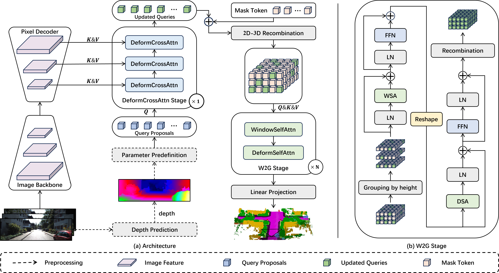

<div align="center">

# H2GFormer: Horizontal-to-Global Voxel Transformer for 3D Semantic Scene Completion
</div>

> Implementation of 3D semantic scene completion method in PyTorch.

> Code release for the paper H2GFormer: Horizontal-to-Global Voxel Transformer for 3D Semantic Scene Completion.


## Abstract
3D Semantic Scene Completion (SSC) has emerged as a novel task in vision-based holistic 3D scene understanding. Its objective is to densely predict the occupancy and category of each voxel in a 3D scene based on input from either LiDAR or images. Currently, many transformer-based semantic scene completion frameworks employ simple yet popular Cross-Attention and Self-Attention mechanisms to integrate and infer dense geometric and semantic information of voxels. However, they overlook the distinctions among voxels in the scene, especially in outdoor scenarios where the horizontal direction contains more variations. And voxels located at object boundaries and within the interior of objects exhibit varying levels of positional significance. To address this issue, we propose a transformer-based SSC framework called H2GFormer that incorporates a horizontal-to-global approach. This framework takes into full consideration the variations of voxels in the horizontal direction and the characteristics of voxels on object boundaries. We introduce horizontal window-to-global attention (W2G) module that effectively fuses semantic information by first diffusing it horizontally from reliable visible voxels and then propagating the semantic understanding to global voxels, ensuring a more reliable fusion of semantic-aware features. Moreover, an Internal-External Position Awareness Loss (IoE-PALoss) is utilized during network training to emphasize the critical positions within the transition regions between objects. The experiments conducted on the SemanticKITTI dataset demonstrate that H2GFormer exhibits superior performance in both geometric and semantic completion tasks.

## Method
|  | 
|:--:| 
| *Figure 1: (a) The overall architecture of H2GFormer. The image backbone and pixel decoder extract features from single or multiple images, which are then fed into the DeformCrossAttn Stage using a hierarchical multi-scale feature allocation strategy. Subsequently, the predefined features of the visible region are combined with a mask token and propagated through the W2G stage to diffuse the features. Finally, upsampling and projection are performed to obtain the semantic scene completion results. (b) The structure of the W2G stage, which involves windowed self-attention (WSA) and deformable self-attention (DSA).* |

## Getting Started
### Datasets
##### SemanticKITTI
[SemanticKITTI](https://github.com/NVlabs/VoxFormer). Please refer to Voxformer for the details.

### Run and Eval
Train H2GFormer with 1 GPU
```
./tools/dist_train.sh ./projects/configs/H2GFormer/H2GFormer-T.py 1
```
Eval H2GFormer with 1 GPU
```
./tools/dist_test.sh ./projects/configs/H2GFormer/H2GFormer-T.py ./path/to/ckpts.pth 1
```

### Visualization
[Visualization](https://github.com/astra-vision/MonoScene). Please refer to MonoScene for the details.


## Model Zoo

## Visualization

## TODO

- [x] SemanticKITTI
- [ ] Model Zoo
- [ ] SSCBench-nuScenes

## Acknowledgement

Many thanks to these excellent open source projects:
- [mmdet3d](https://github.com/open-mmlab/mmdetection3d)
- [MonoScene](https://github.com/astra-vision/MonoScene)
- [VoxFormer](https://github.com/NVlabs/VoxFormer)